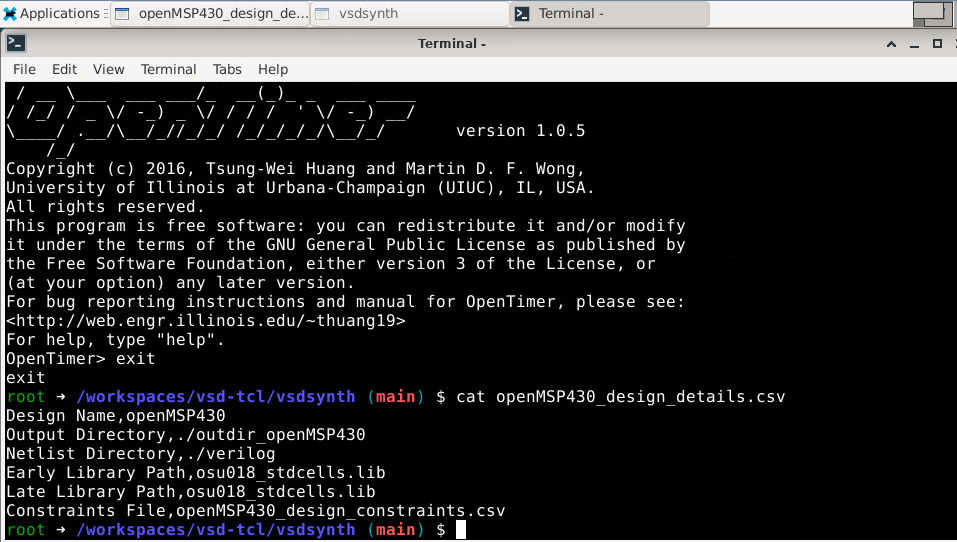
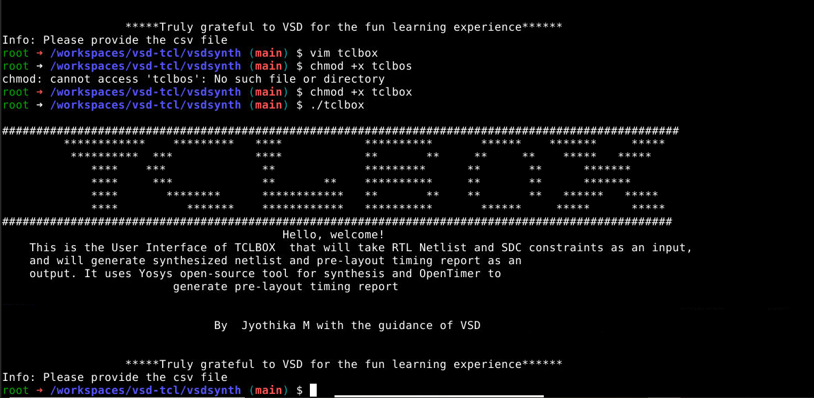
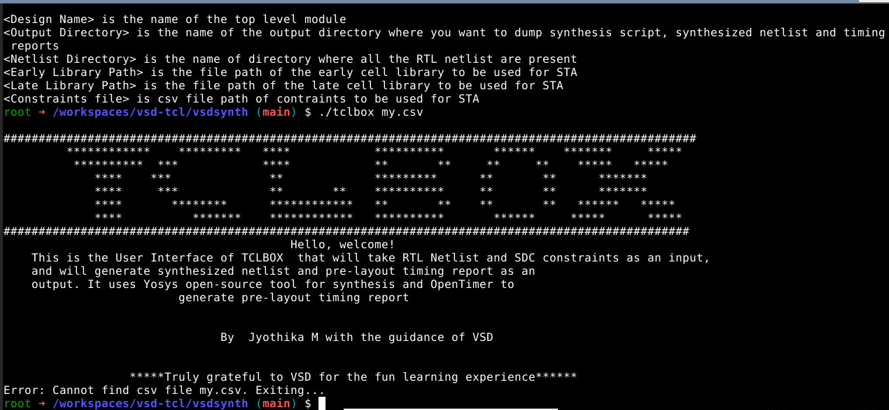
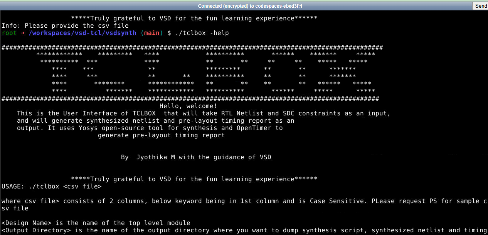

# Lab-Day1

## Introduction to TCL and VSDSYNTH Toolbox Usage

1.Created a txt file called tclbox in the vsdsynth directory.

2.Used Linux scripting to create a UI for the tool box, create a command called 'vsdsynth'(I have created a command called 'tclbox' which has the same functionality of vsdsynth as shown in the workshop) and pass te input file(location of the file) the content in the file is as shown below.

3.There are different scenarios that we have taken care of which creating the bash script.

i)When there is no argument given by the user (eg ./tclbox <no argumnet> )

ii)When the user has given a file location that does not exist.

iii)When the user needs to understand the syntax for the command using '-help'

